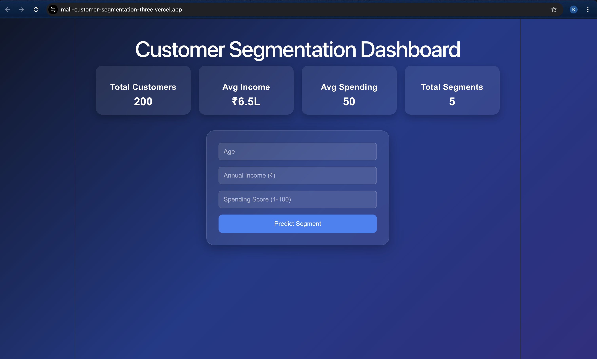
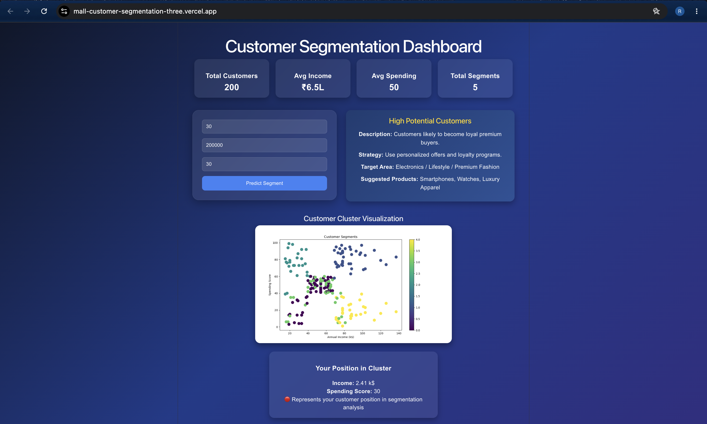

# Mall Customer Segmentation Dashboard

A machine learning-based dashboard that segments mall customers into different groups based on Age, Annual Income, and Spending Score.

## Live Demo

**Frontend:** https://mall-customer-segmentation-three.vercel.app/

**Backend API:** https://mall-customer-backend.onrender.com

## Dashboard



## Prediction Example



## Features

- Customer segmentation using KMeans Clustering
- Flask backend API
- React frontend dashboard
- Interactive segment prediction
- Customer cluster visualization
- Business strategy recommendations

## Tech Stack

- React.js
- Flask
- Python
- Scikit-learn
- Matplotlib
- KMeans Clustering

## Customer Segments

- Budget Conscious
- Affluent Spenders
- High Potential Customers
- Occasional Shoppers
- Value Seekers

## Run Locally

### Frontend

```bash
cd frontend
npm install
npm run dev
```

### Backend

```bash
cd backend
pip install -r requirements.txt
python server.py
```

## Future Improvements

- Interactive cluster graph
- Live customer highlighting
- Advanced analytics dashboard
- Customer history tracking
- Authentication and user management